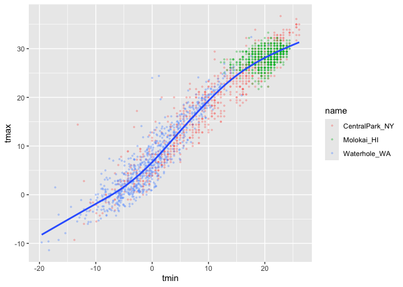
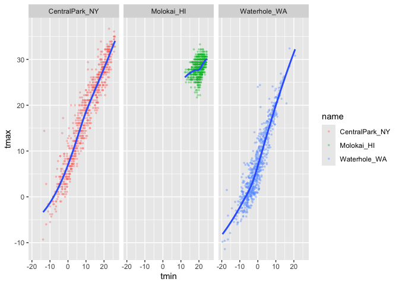
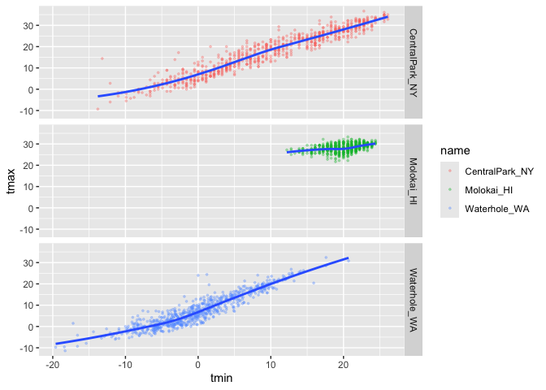
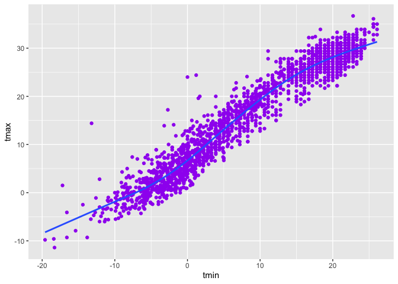
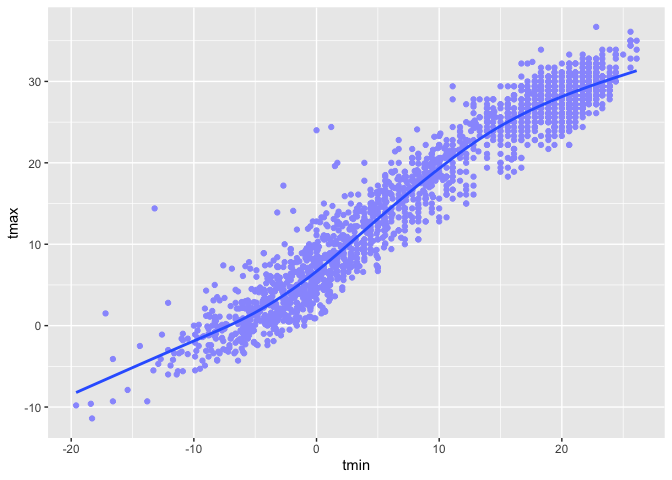
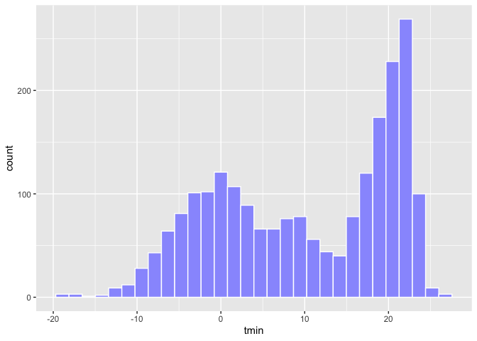
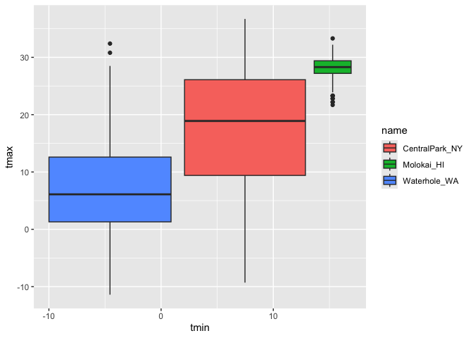
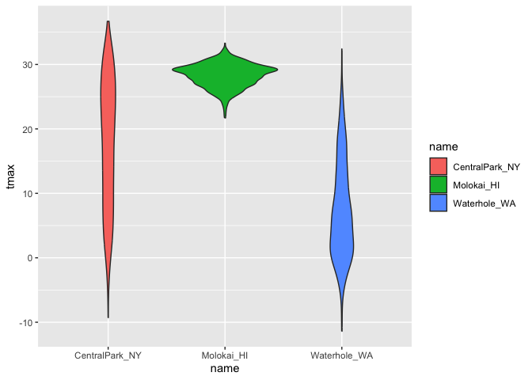
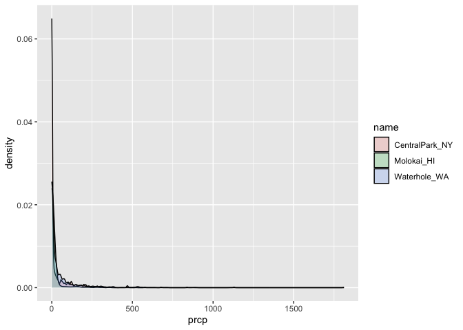
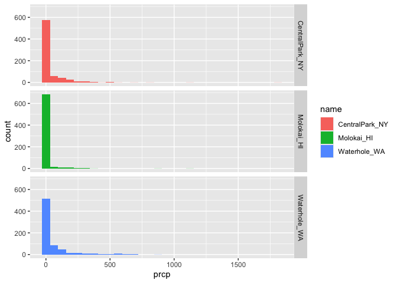

Visualization_I
================
2025-09-25

## Loading the data

``` r
library(tidyverse)
```

    ## ── Attaching core tidyverse packages ──────────────────────── tidyverse 2.0.0 ──
    ## ✔ dplyr     1.1.4     ✔ readr     2.1.5
    ## ✔ forcats   1.0.0     ✔ stringr   1.5.1
    ## ✔ ggplot2   3.5.2     ✔ tibble    3.3.0
    ## ✔ lubridate 1.9.4     ✔ tidyr     1.3.1
    ## ✔ purrr     1.1.0     
    ## ── Conflicts ────────────────────────────────────────── tidyverse_conflicts() ──
    ## ✖ dplyr::filter() masks stats::filter()
    ## ✖ dplyr::lag()    masks stats::lag()
    ## ℹ Use the conflicted package (<http://conflicted.r-lib.org/>) to force all conflicts to become errors

``` r
library(ggridges)
library(p8105.datasets)
```

Import the weather data

``` r
data("weather_df")
```

## Making our first plot

``` r
#this is very formal 
ggplot( data = weather_df, mapping = aes(x = tmin, y = tmax)) +
  geom_point()
```

    ## Warning: Removed 17 rows containing missing values or values outside the scale range
    ## (`geom_point()`).

<!-- -->

``` r
#this is more what like you will see 
ggplot( data = weather_df, aes(x = tmin, y = tmax)) +
  geom_point()
```

    ## Warning: Removed 17 rows containing missing values or values outside the scale range
    ## (`geom_point()`).

<!-- -->

``` r
#you use the + operator because it was created before the pipe operator 
```

``` r
gg_weather_scatterplot = 
  weather_df |> 
    ggplot(aes(x = tmin, y = tmax)) +
    geom_point()

gg_weather_scatterplot
```

    ## Warning: Removed 17 rows containing missing values or values outside the scale range
    ## (`geom_point()`).

<!-- -->

``` r
#when we run this, we get a warning message that says 17 rows with missing values were removed
```

Check that some rows are missing

``` r
weather_df |> 
  filter(is.na(tmax))
```

    ## # A tibble: 17 × 6
    ##    name         id          date        prcp  tmax  tmin
    ##    <chr>        <chr>       <date>     <dbl> <dbl> <dbl>
    ##  1 Molokai_HI   USW00022534 2022-05-31    NA    NA    NA
    ##  2 Waterhole_WA USS0023B17S 2021-03-09    NA    NA    NA
    ##  3 Waterhole_WA USS0023B17S 2021-12-07    51    NA    NA
    ##  4 Waterhole_WA USS0023B17S 2021-12-31     0    NA    NA
    ##  5 Waterhole_WA USS0023B17S 2022-02-03     0    NA    NA
    ##  6 Waterhole_WA USS0023B17S 2022-08-09    NA    NA    NA
    ##  7 Waterhole_WA USS0023B17S 2022-08-10    NA    NA    NA
    ##  8 Waterhole_WA USS0023B17S 2022-08-11    NA    NA    NA
    ##  9 Waterhole_WA USS0023B17S 2022-08-12    NA    NA    NA
    ## 10 Waterhole_WA USS0023B17S 2022-08-13    NA    NA    NA
    ## 11 Waterhole_WA USS0023B17S 2022-08-14    NA    NA    NA
    ## 12 Waterhole_WA USS0023B17S 2022-08-15    NA    NA    NA
    ## 13 Waterhole_WA USS0023B17S 2022-08-16    NA    NA    NA
    ## 14 Waterhole_WA USS0023B17S 2022-08-17    NA    NA    NA
    ## 15 Waterhole_WA USS0023B17S 2022-08-18    NA    NA    NA
    ## 16 Waterhole_WA USS0023B17S 2022-08-19    NA    NA    NA
    ## 17 Waterhole_WA USS0023B17S 2022-12-31    76    NA    NA

``` r
#whole package called nanir (tidy friendly functions) to look at missingness across all variables
```

## Fancier Scatter Plots

``` r
weather_df |> 
  ggplot(aes(x = tmin, y = tmax, color = name)) +
  geom_point(alpha = 0.3) +
  geom_smooth(se = FALSE)
```

    ## `geom_smooth()` using method = 'loess' and formula = 'y ~ x'

    ## Warning: Removed 17 rows containing non-finite outside the scale range
    ## (`stat_smooth()`).

    ## Warning: Removed 17 rows containing missing values or values outside the scale range
    ## (`geom_point()`).

<!-- -->

``` r
#when you want color to vary based on data, you put it within the aes statement
#alpha ranges 0 to 1 where 1 is compeletly opaque
#geom_smooth() --> includes FALSE satement to get rid of the SE shading (dont really trust that)
```

Where you define aesthetics does matter

``` r
weather_df |> 
  ggplot(aes(x = tmin, y = tmax)) +
  geom_point(aes(color = name), alpha = 0.3, size = 0.6) +
  geom_smooth(se = FALSE)
```

    ## `geom_smooth()` using method = 'gam' and formula = 'y ~ s(x, bs = "cs")'

    ## Warning: Removed 17 rows containing non-finite outside the scale range
    ## (`stat_smooth()`).

    ## Warning: Removed 17 rows containing missing values or values outside the scale range
    ## (`geom_point()`).

<!-- -->

``` r
#size can be a decimal or larger than 1

weather_df |> 
  ggplot(aes(x = tmin, y = tmax)) +
  geom_point(aes(color = name, size = prcp), alpha = 0.3) +
  geom_smooth(se = FALSE)
```

    ## `geom_smooth()` using method = 'gam' and formula = 'y ~ s(x, bs = "cs")'

    ## Warning: Removed 17 rows containing non-finite outside the scale range
    ## (`stat_smooth()`).

    ## Warning: Removed 19 rows containing missing values or values outside the scale range
    ## (`geom_point()`).

<!-- -->

``` r
#second way we have size of point is being adjusted based on prcp variable
```

## Using Faceting real quick

Faceting – breaking a single plot into multiple plots

``` r
weather_df |> 
  ggplot(aes(x = tmin, y = tmax)) +
  geom_point(aes(color = name), alpha = 0.3, size = 0.6) +
  geom_smooth(se = FALSE) +
  facet_grid(.~ name)
```

    ## `geom_smooth()` using method = 'loess' and formula = 'y ~ x'

    ## Warning: Removed 17 rows containing non-finite outside the scale range
    ## (`stat_smooth()`).

    ## Warning: Removed 17 rows containing missing values or values outside the scale range
    ## (`geom_point()`).

<!-- -->

``` r
#. means nothing (1 row) and ~ (by) [name]

weather_df |> 
  ggplot(aes(x = tmin, y = tmax)) +
  geom_point(aes(color = name), alpha = 0.3, size = 0.6) +
  geom_smooth(se = FALSE) +
  facet_grid(name ~.)
```

    ## `geom_smooth()` using method = 'loess' and formula = 'y ~ x'

    ## Warning: Removed 17 rows containing non-finite outside the scale range
    ## (`stat_smooth()`).
    ## Removed 17 rows containing missing values or values outside the scale range
    ## (`geom_point()`).

<!-- -->

``` r
#this second version means rows = # of [names] and column = . (aka nothing)
```

Now let’s get a little more spicy

``` r
weather_df |> 
  ggplot(aes(x = tmin, y = tmax, color = name, shape = name)) +
  geom_point(aes(size = prcp), alpha = 0.3) +
  geom_smooth(se = FALSE) +
  facet_grid(. ~ name)
```

    ## `geom_smooth()` using method = 'loess' and formula = 'y ~ x'

    ## Warning: Removed 17 rows containing non-finite outside the scale range
    ## (`stat_smooth()`).

    ## Warning: Removed 19 rows containing missing values or values outside the scale range
    ## (`geom_point()`).

<!-- -->

``` r
#shape = name --> changes shape of point based on [name]
```

## Learning Assessment

``` r
weather_df |> 
  filter(name == "CentralPark_NY") |> 
  mutate(
    tmax_fahr = tmax*(9/5) + 32,
    tmin_fahr = tmin*(9/5) + 32,  
      ) |> 

  ggplot(aes(x = tmin_fahr, y = tmax_fahr)) +
  geom_point() +
  geom_smooth(se = FALSE, method = "lm")
```

    ## `geom_smooth()` using formula = 'y ~ x'

<!-- -->

``` r
#when we run this, we get a message in console telling us how it is creating the smooth line
#^This message tells you what the smooth is doing
#used ?geom_smooth() in console to find how to add method="" argument in 
```

## Small things

We can get rid of the points

``` r
weather_df |> 
  ggplot(aes(x = tmin, y = tmax, color = name, shape = name)) +
  #geom_point(alpha = 0.3) +
  geom_smooth(se = FALSE)
```

    ## `geom_smooth()` using method = 'loess' and formula = 'y ~ x'

    ## Warning: Removed 17 rows containing non-finite outside the scale range
    ## (`stat_smooth()`).

<!-- -->

``` r
#Reminder that order matters
weather_df |> 
  ggplot(aes(x = tmin, y = tmax, color = name, shape = name)) +
  geom_smooth(se = FALSE) +
  geom_point()
```

    ## `geom_smooth()` using method = 'loess' and formula = 'y ~ x'

    ## Warning: Removed 17 rows containing non-finite outside the scale range
    ## (`stat_smooth()`).

    ## Warning: Removed 17 rows containing missing values or values outside the scale range
    ## (`geom_point()`).

<!-- -->

## `geom_hex()`

Random use of Hex geom

``` r
weather_df |> 
  ggplot(aes(x = tmin, y = tmax)) +
  geom_hex()
```

    ## Warning: Removed 17 rows containing non-finite outside the scale range
    ## (`stat_binhex()`).

<!-- -->

If someone wanted the entire thing to be purple, do it outside of aes

``` r
weather_df |> 
  ggplot(aes(x = tmin, y = tmax)) +
  geom_point(color = "purple") +
  geom_smooth(se = FALSE)
```

    ## `geom_smooth()` using method = 'gam' and formula = 'y ~ s(x, bs = "cs")'

    ## Warning: Removed 17 rows containing non-finite outside the scale range
    ## (`stat_smooth()`).

    ## Warning: Removed 17 rows containing missing values or values outside the scale range
    ## (`geom_point()`).

<!-- -->

``` r
#this also works with any color HEX code
weather_df |> 
  ggplot(aes(x = tmin, y = tmax)) +
  geom_point(color = "#999bfd") +
  geom_smooth(se = FALSE)
```

    ## `geom_smooth()` using method = 'gam' and formula = 'y ~ s(x, bs = "cs")'

    ## Warning: Removed 17 rows containing non-finite outside the scale range
    ## (`stat_smooth()`).
    ## Removed 17 rows containing missing values or values outside the scale range
    ## (`geom_point()`).

<!-- -->

# PLOTS

## Creating Univariate PLots

``` r
weather_df |> 
  ggplot(aes(x = tmin)) +
  geom_histogram(color = "white", fill = "#999bfd")
```

    ## `stat_bin()` using `bins = 30`. Pick better value with `binwidth`.

    ## Warning: Removed 17 rows containing non-finite outside the scale range
    ## (`stat_bin()`).

<!-- -->

``` r
#overlapping histogram
weather_df |> 
  ggplot(aes(x = tmin, fill = name)) +
  geom_histogram()
```

    ## `stat_bin()` using `bins = 30`. Pick better value with `binwidth`.

    ## Warning: Removed 17 rows containing non-finite outside the scale range
    ## (`stat_bin()`).

<!-- -->

``` r
#facet them
weather_df |> 
  ggplot(aes(x = tmin, fill = name)) +
  geom_histogram() +
  facet_grid(name ~ .)
```

    ## `stat_bin()` using `bins = 30`. Pick better value with `binwidth`.

    ## Warning: Removed 17 rows containing non-finite outside the scale range
    ## (`stat_bin()`).

<!-- -->

``` r
#as a univariate, aes() takes only one variable
```

## Density

Maybe a desnity plot, anyone?

``` r
weather_df |> 
  ggplot(aes(x = tmin, fill = name)) +
  geom_density(alpha = 0.2)
```

    ## Warning: Removed 17 rows containing non-finite outside the scale range
    ## (`stat_density()`).

<!-- -->

``` r
#frequency divided by the total
```

## Box

Or a box plot perhaps….

``` r
#Note: this takes two aesthetics now

weather_df |> 
  ggplot(aes(x = tmin, y = tmax, fill = name)) +
  geom_boxplot()
```

    ## Warning: Removed 17 rows containing missing values or values outside the scale range
    ## (`stat_boxplot()`).

<!-- -->

``` r
#In this case whether you put fill = name in ggplot(aes()) or in geom_boxplot(aes()), you will get the sae result 
weather_df |> 
  ggplot(aes(x = tmin, y = tmax)) +
  geom_boxplot(aes(fill = name))
```

    ## Warning: Removed 17 rows containing missing values or values outside the scale range
    ## (`stat_boxplot()`).

<!-- -->

When you map an aesthetic in aes, you say you want it to vary by some
variable in the dataset When you set an aesthetic outside aes(), you are
setting it for the entire figure

## Violin

Now, back to the days of the violin plot

``` r
weather_df |> 
  ggplot(aes(x = name, y = tmax)) +
  geom_violin(aes(fill = name))
```

    ## Warning: Removed 17 rows containing non-finite outside the scale range
    ## (`stat_ydensity()`).

<!-- -->

``` r
#vertical version of the density plot turned symmetrical
```

## Ridge

Ridge plots

``` r
weather_df |> 
  ggplot(aes(x = tmin, y = name)) +
  geom_density_ridges()
```

    ## Picking joint bandwidth of 1.41

    ## Warning: Removed 17 rows containing non-finite outside the scale range
    ## (`stat_density_ridges()`).

<!-- -->

``` r
#Across the y axis we have the names 
```

# Learning Assessment - Univariate PLots

``` r
weather_df |> 
  ggplot(aes(x = prcp, fill = name)) +
  geom_density(alpha = 0.2)
```

    ## Warning: Removed 15 rows containing non-finite outside the scale range
    ## (`stat_density()`).

<!-- -->

``` r
#^looks bad

weather_df |> 
  ggplot(aes(x = prcp, fill = name)) +
  geom_histogram() +
  facet_grid(name ~ .)
```

    ## `stat_bin()` using `bins = 30`. Pick better value with `binwidth`.

    ## Warning: Removed 15 rows containing non-finite outside the scale range
    ## (`stat_bin()`).

<!-- -->

``` r
#^looks maybe...slightly?! better...

weather_df |> 
  filter(prcp > 5, prcp < 1000) |> 
  ggplot(aes(x = prcp, fill = name)) +
  geom_density(alpha = 0.2)
```

<!-- -->

``` r
#this zooms in --> shortens the scale--> but make sure you notify your audience! 
```

# Saving and Embedding Plots

Saving plots

``` r
ggp_weather_violins = 
    weather_df |> 
    ggplot(aes(x = name, y = tmax)) +
    geom_violin(aes(fill = name))

ggp_weather_violins
```

    ## Warning: Removed 17 rows containing non-finite outside the scale range
    ## (`stat_ydensity()`).

<!-- -->

``` r
ggsave("Visualization_I_files/weather_violin_plot.pdf", ggp_weather_violins, width = 8, height = 6)
```

    ## Warning: Removed 17 rows containing non-finite outside the scale range
    ## (`stat_ydensity()`).

embedding plots ……… i have no idea what we were talking about here
